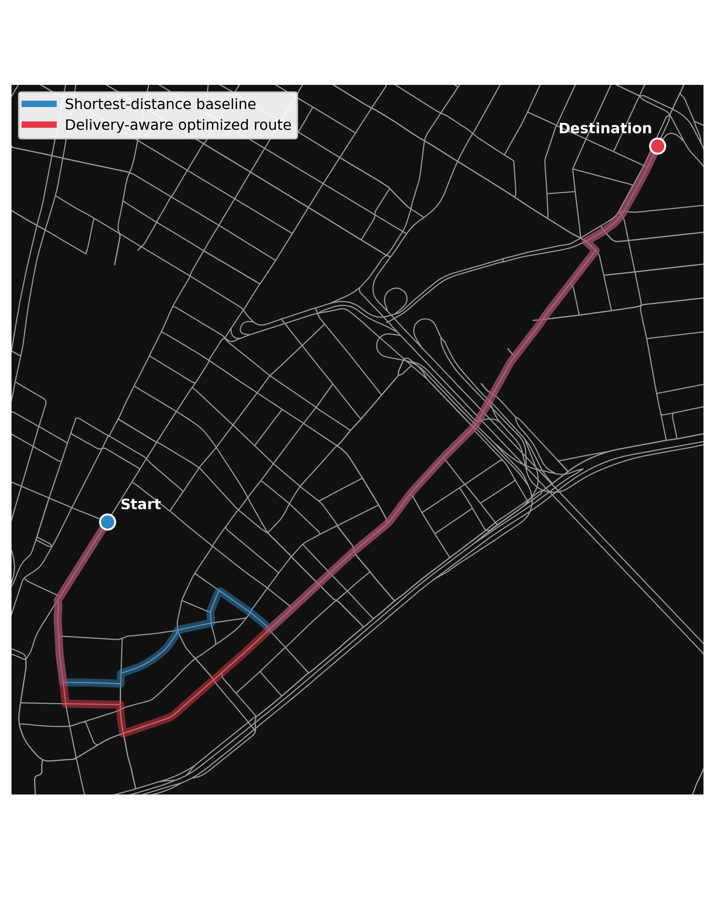
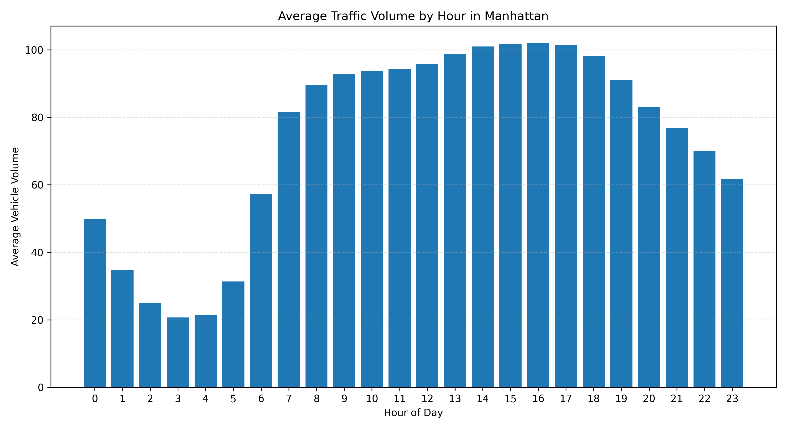
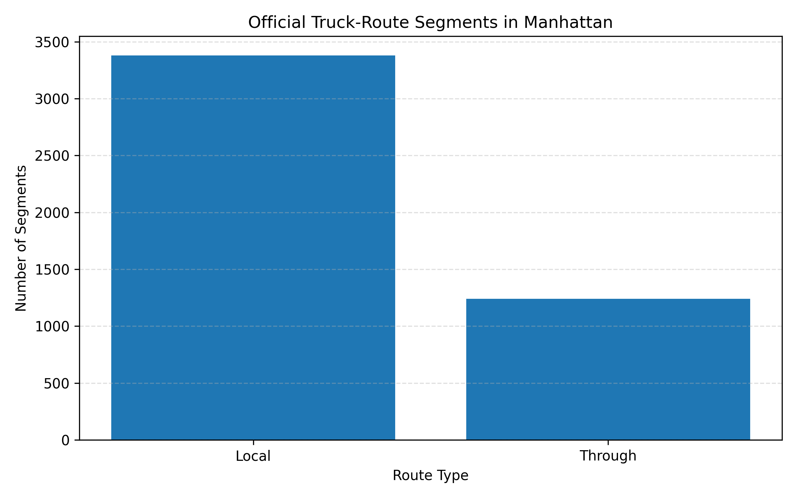
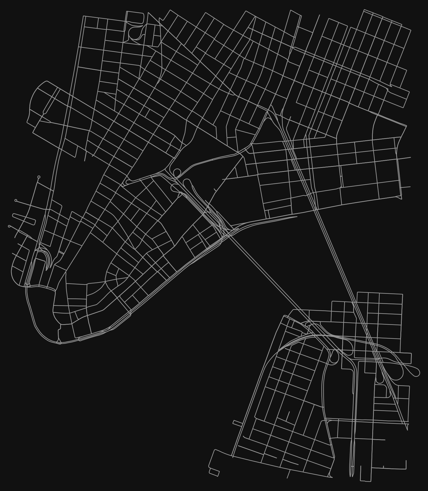

# Manhattan Last-Mile Delivery Optimizer

A delivery-aware routing prototype for Lower Manhattan that compares traditional shortest-distance routing with optimized routes designed for last-mile delivery constraints.

This project uses real NYC transportation datasets, OpenStreetMap road networks, graph algorithms, and a Flask/Leaflet web application to model how delivery routes can be improved when congestion, curb/loading access, and truck-route restrictions are considered.

---

## Project Overview

Last-mile delivery in Manhattan is not only about finding the shortest route. Delivery drivers also have to deal with traffic congestion, legal truck routes, loading zones, parking restrictions, and limited curb access.

This project builds a routing prototype that compares:

* a shortest-distance baseline route
* a delivery-aware optimized route

The delivery-aware route uses a custom graph edge cost that considers:

* traffic congestion
* parking/loading access
* truck-route restriction risk

The result is a system that demonstrates how real-world urban delivery constraints can be incorporated into graph-based routing.

---

## Demo / Showcase Result

The main showcase route compares travel from the Financial District to Chinatown.

| Metric                    |      Result |
| ------------------------- | ----------: |
| Baseline distance         |  2,577.56 m |
| Optimized distance        |  2,612.57 m |
| Added distance            |     35.01 m |
| Baseline delivery cost    |    3,464.60 |
| Optimized delivery cost   |    3,429.98 |
| Delivery-cost improvement | 34.62 units |
| Dijkstra and A* agreement |        True |

The optimized route added only 35.01 meters while reducing the modeled delivery cost by 34.62 units.



---

## Features

* Builds a routable Lower Manhattan street network using OSMnx and NetworkX
* Compares shortest-distance routing against delivery-aware routing
* Implements Dijkstra's algorithm and A* search
* Uses real NYC traffic, parking/loading sign, and truck-route datasets
* Applies a component-based scoring model for incomplete public data coverage
* Reports route distance, cost improvement, and data coverage
* Visualizes routes through a Flask and Leaflet web application
* Generates charts and CSV outputs for analysis and validation

---

## Tech Stack

**Languages:** Python, JavaScript, HTML, CSS
**Backend:** Flask
**Mapping:** Leaflet.js, OpenStreetMap
**Data / Graph Tools:** pandas, NetworkX, OSMnx
**Visualization:** Matplotlib
**Algorithms:** Dijkstra's algorithm, A* search

---

## Data Sources

The project uses four main data sources:

1. NYC traffic volume data
2. NYC parking/loading regulation sign data
3. NYC official truck-route data
4. OpenStreetMap road network data through OSMnx

The system combines these datasets with a Lower Manhattan driving graph to assign delivery-aware costs to road segments.

---

## Methodology

The road network is represented as a directed graph:

* intersections are nodes
* road segments are edges
* each edge has a physical distance
* each edge receives a delivery difficulty score when data is available

The baseline route minimizes physical distance.

The delivery-aware route uses a custom cost function:

```text
Delivery Cost = Edge Length × (1 + Delivery Difficulty Score)
```

The delivery difficulty score combines:

```text
0.40 × congestion penalty
0.30 × parking/loading penalty
0.30 × truck-route restriction penalty
```

Because public datasets do not cover every street evenly, the project uses a component-based scoring method. If a street segment has traffic, parking, or truck-route data, that information is used. If a component is missing, the model applies a neutral fallback value and reports data coverage for transparency.

---

## Visualizations

### Average Traffic Volume by Hour



### Truck Route Type Distribution



### Lower Manhattan Network



---

## Project Structure

```text
manhattan-delivery-optimizer/
│
├── app/
│   ├── app.py
│   ├── static/
│   │   ├── css/
│   │   └── js/
│   └── templates/
│
├── src/
│   ├── routing_engine/
│   ├── traffic_analysis.py
│   ├── parking_analysis.py
│   ├── truck_analysis.py
│   ├── create_lower_manhattan_network.py
│   ├── create_component_weighted_network.py
│   └── evaluate_component_routes.py
│
├── data/
│   └── output/
│
├── figures/
│
├── README.md
├── requirements.txt
└── .gitignore
```

---

## How to Run

Clone the repository:

```bash
git clone https://github.com/prasun-rimal/manhattan-delivery-optimizer.git
cd manhattan-delivery-optimizer
```

Install dependencies:

```bash
pip install -r requirements.txt
```

Run the Flask app:

```bash
python app/app.py
```

Then open the local URL shown in the terminal.

---

## Limitations

This project is a research prototype, not a production routing platform.

Current limitations include:

* the prototype focuses on Lower Manhattan rather than all of Manhattan
* traffic data coverage is limited by the available public dataset
* parking/loading access is scored through rule-based text matching
* parking rules are not yet time-dependent
* vehicle-specific restrictions such as height, weight, axle count, and hazardous materials are not yet modeled
* the delivery-cost score is a relative decision-support metric, not a direct measurement of travel time or financial cost

---

## Future Work

Future improvements could include:

* expanding the graph to full Manhattan
* adding live or broader traffic data
* parsing time-dependent parking/loading rules
* allowing users to adjust congestion, parking, and truck-route weights
* adding address-based input with geocoding
* improving route explanations in the web interface
* deploying the web app online

---

## Author

**Prasun Rimal**
B.S. Mathematics and B.S. Computer Science
St. Joseph's University, New York
